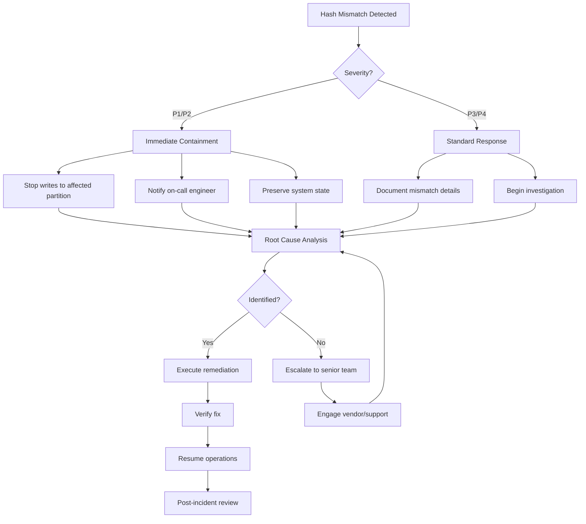

# Hash Mismatch Incident Response Runbook

## Overview

This runbook provides step-by-step procedures for responding to hash mismatch incidents in the immutable ledger.

## Severity Classification

| Severity | Criteria | Response Time | Escalation |
|----------|----------|---------------|------------|
| P1-Critical | Multiple consecutive mismatches or genesis corruption | 15 minutes | Immediate C-level |
| P2-High | Single entry mismatch in recent data (<24h) | 1 hour | Engineering Director |
| P3-Medium | Single entry in historical data (>24h) | 4 hours | Engineering Manager |
| P4-Low | Detected during non-production verification | 24 hours | Team Lead |

---

## Compliance

### ISO Standards Mapping

| ISO Standard | Requirement | Implementation |
|--------------|-------------|----------------|
| **ISO 27001:2022** | A.5.24 - Information security incident management | This runbook provides structured incident response procedures |
| **ISO 27001:2022** | A.5.25 - Assessment and decision on information security events | Severity classification enables appropriate response decisions |
| **ISO 27001:2022** | A.5.26 - Response to information security incidents | Step-by-step response procedures with escalation paths |
| **ISO 27001:2022** | A.5.27 - Learning from information security incidents | Post-incident review requirements documented |
| **ISO 27035** | Information security incident management | Follows ISO 27035 incident management phases |
| **ISO 27001:2022** | A.5.28 - Collection of evidence | Evidence preservation procedures for potential legal action |
| **ISO 22301** | Business continuity - incident response | Procedures minimize business impact during incidents |

### Regulatory Compliance

| Regulation | Compliance Requirement |
|------------|------------------------|
| **GDPR Article 33** | Data breach notification - hash mismatch may indicate breach |
| **SOX Section 302/906** | Financial reporting integrity - hash mismatch affects financial controls |
| **PCI DSS 4.0 Req 12.10** | Incident response plan - this runbook satisfies requirement |
| **NERC CIP** | Critical infrastructure protection - incident response procedures |
| **Basel III** | Operational risk management - incident classification and response |

---

## Security Considerations

### Incident Response Security Model

```
┌─────────────────────────────────────────────────────────────────┐
│                    INCIDENT RESPONSE SECURITY                    │
├─────────────────────────────────────────────────────────────────┤
│ 1. Access Control                                                │
│    - Incident response team: LEDGER_INCIDENT_RESPONDER role      │
│    - Forensic analysis: LEDGER_FORENSIC role                     │
│    - Emergency actions: LEDGER_EMERGENCY_ADMIN role              │
├─────────────────────────────────────────────────────────────────┤
│ 2. Evidence Preservation                                         │
│    - Immediate snapshot of affected entries                      │
│    - Immutable storage for forensic evidence                     │
│    - Chain of custody documentation                              │
├─────────────────────────────────────────────────────────────────┤
│ 3. Communication Security                                        │
│    - Encrypted incident channels (Signal/Wire)                   │
│    - Secure evidence sharing (encrypted drives)                  │
│    - Need-to-know basis for sensitive details                    │
├─────────────────────────────────────────────────────────────────┤
│ 4. Containment Controls                                          │
│    - Read-only mode for affected partitions                      │
│    - Transaction throttling during investigation                 │
│    - Emergency stop capability for critical issues               │
└─────────────────────────────────────────────────────────────────┘
```

### Security Checklist

| Phase | Check | Verification |
|-------|-------|--------------|
| Detection | Incident alert received | PagerDuty/VictorOps notification |
| Triage | Severity correctly classified | Match criteria to severity table |
| Response | Responder identity verified | Multi-factor authentication check |
| Containment | Affected systems isolated | Network segmentation verification |
| Evidence | Chain of custody maintained | Evidence log signatures |
| Recovery | Integrity verified before resumption | Hash chain verification passed |

### Threat Scenarios

| Scenario | Likely Cause | Response Priority |
|----------|--------------|-------------------|
| Single entry mismatch | Application bug, race condition | P2 - Standard response |
| Consecutive mismatches | Batch job error, data corruption | P1 - Emergency response |
| Genesis mismatch | System compromise, initialization error | P1 - Emergency + forensic |
| Scattered mismatches | Hardware failure, bit rot | P1 - Emergency response |
| All entries since time | Schema change, algorithm error | P1 - Emergency response |

---

## Audit Requirements

### Required Audit Records

| Record Type | Location | Retention | Standard |
|-------------|----------|-----------|----------|
| Incident timeline | incident_response_log | 7 years | ISO 27035 |
| Evidence snapshots | incident_snapshots schema | 10 years | Legal hold |
| Communication logs | incident_communications | 3 years | Internal audit |
| Remediation actions | incident_actions | 7 years | SOX compliance |
| Post-incident review | incident_post_mortems | Indefinite | Knowledge management |

### Audit Log Schema

```sql
CREATE TABLE incident_response_log (
    incident_id UUID PRIMARY KEY DEFAULT gen_random_uuid(),
    severity VARCHAR(10) NOT NULL,  -- P1, P2, P3, P4
    incident_type VARCHAR(50) NOT NULL,  -- HASH_MISMATCH, etc.
    detected_at TIMESTAMP NOT NULL,
    detected_by VARCHAR(100),
    acknowledged_at TIMESTAMP,
    acknowledged_by VARCHAR(100),
    contained_at TIMESTAMP,
    resolved_at TIMESTAMP,
    root_cause TEXT,
    business_impact TEXT,
    data_impact TEXT,
    affected_entries BIGINT,
    affected_accounts INTEGER,
    financial_impact DECIMAL(19,4),
    status VARCHAR(20) NOT NULL,  -- OPEN, CONTAINED, RESOLVED, CLOSED
    lesson_learned TEXT,
    preventive_actions TEXT[]
);
```

### Evidence Preservation

```sql
-- Create incident evidence package
CREATE OR REPLACE FUNCTION create_incident_evidence(
    p_incident_id UUID,
    p_entry_id BIGINT
) RETURNS VOID AS $$
BEGIN
    -- Create evidence snapshot
    EXECUTE format(
        'CREATE TABLE incident_snapshots.evidence_%s_%s AS
         SELECT 
             le.*,
             lhc.cumulative_hash as stored_chain_hash,
             encode(le.entry_hash, ''hex'') as entry_hash_hex,
             encode(lhc.cumulative_hash, ''hex'') as chain_hash_hex
         FROM ledger_entries le
         JOIN ledger_hash_chain lhc ON le.entry_id = lhc.entry_id
         WHERE le.entry_id = %s',
        p_incident_id::text, p_entry_id, p_entry_id
    );
    
    -- Log evidence creation
    INSERT INTO incident_evidence_log (
        incident_id, evidence_type, evidence_location, created_at
    ) VALUES (
        p_incident_id, 'ENTRY_SNAPSHOT', 
        format('incident_snapshots.evidence_%s_%s', p_incident_id::text, p_entry_id),
        NOW()
    );
END;
$$ LANGUAGE plpgsql;
```

---

## Data Protection Notes

### PII Handling During Incidents

During hash mismatch investigations:

| Data Element | Handling | Justification |
|--------------|----------|---------------|
| MSISDN | Tokenized in evidence | PII protection during investigation |
| Account ID | Retained | Required for impact assessment |
| Transaction amounts | Retained | Financial impact analysis |
| Client IP | Masked (last octet) | Privacy protection |
| Metadata | Reviewed case-by-case | May contain PII |

### Evidence Retention

| Evidence Type | Retention | Encryption |
|---------------|-----------|------------|
| Entry snapshots | 10 years | AES-256 at rest |
| System state | 3 years | AES-256 at rest |
| Communication logs | 3 years | Encrypted channel only |
| Forensic images | 10 years | Hardware encryption |

### Data Subject Rights

If hash mismatch indicates potential breach:

| Right | Response |
|-------|----------|
| Right to be informed | Assess breach notification requirements per GDPR Article 33 |
| Right of access | Provide affected subject's data if requested |
| Right to rectification | Correction procedures if data was altered |
| Right to erasure | Subject to legal hold for investigation |

---

## Incident Response Flow



---

## Immediate Response (First 15 Minutes)

### Step 1: Acknowledge and Assess

```bash
#!/bin/bash
# incident_assessment.sh - Run immediately on detection

echo "=== Hash Mismatch Incident Assessment ==="
echo "Timestamp: $(date -Iseconds)"
echo "Responder: $(whoami)"
echo "Incident ID: INC-$(date +%Y%m%d-%H%M%S)"

# Log incident start
psql -U admin -d ledger_db -c "
    INSERT INTO incident_response_log (
        severity, incident_type, detected_at, detected_by, status
    ) VALUES (
        'P2', 'HASH_MISMATCH', NOW(), current_user, 'OPEN'
    ) RETURNING incident_id;
"

# Get mismatch details
psql -U admin -d ledger_db <<'EOF'
SELECT 
    iv.violation_id,
    iv.entry_id,
    iv.violation_type,
    iv.detected_at,
    le.created_at as entry_time,
    le.account_id,
    le.amount,
    le.transaction_ref
FROM integrity_violations iv
JOIN ledger_entries le ON iv.entry_id = le.entry_id
WHERE iv.investigation_status = 'PENDING'
ORDER BY iv.detected_at DESC;
EOF

# Check for patterns
echo "=== Pattern Analysis ==="
psql -U admin -d ledger_db -c "
SELECT 
    DATE_TRUNC('hour', detected_at) as hour,
    COUNT(*) as violation_count
FROM integrity_violations
WHERE detected_at > NOW() - INTERVAL '24 hours'
GROUP BY 1
ORDER BY 1 DESC;
"
```

### Step 2: Determine Scope

```sql
-- Check if isolated or systemic issue
WITH violation_scope AS (
    SELECT 
        COUNT(*) as total_violations,
        COUNT(DISTINCT DATE_TRUNC('hour', detected_at)) as affected_hours,
        MIN(entry_id) as first_entry,
        MAX(entry_id) as last_entry
    FROM integrity_violations
    WHERE investigation_status = 'PENDING'
)
SELECT 
    total_violations,
    affected_hours,
    last_entry - first_entry + 1 as entry_range,
    CASE 
        WHEN total_violations = 1 THEN 'ISOLATED'
        WHEN affected_hours = 1 THEN 'BATCH_ISSUE'
        WHEN affected_hours > 1 THEN 'SYSTEMIC'
        ELSE 'UNKNOWN'
    END as scope_classification
FROM violation_scope;
```

### Step 3: Immediate Containment (if P1/P2)

```sql
-- Enable read-only mode for affected partition (if applicable)
-- Note: This requires the pg_readonly extension or table-level locks

-- Option 1: Create advisory lock to signal application layer
SELECT pg_advisory_lock(12345);  -- Unique ID for hash mismatch incident

-- Option 2: Insert into incident flag table
INSERT INTO incident_flags (
    flag_type, severity, description, 
    affected_table, created_at, created_by
) VALUES (
    'HASH_MISMATCH', 
    'CRITICAL',
    'Hash mismatch detected - writes temporarily restricted',
    'ledger_entries',
    NOW(),
    current_user
);

-- Notify application to pause non-critical writes
NOTIFY ledger_alert, '{"type": "hash_mismatch", "severity": "critical", "timestamp": "' || NOW() || '"}';

-- Log containment action
UPDATE incident_response_log
SET contained_at = NOW(),
    acknowledged_by = current_user
WHERE incident_id = 'INCIDENT_ID';
```

---

## Investigation Phase

### Step 4: Gather Evidence

```sql
-- Create incident snapshot
CREATE SCHEMA IF NOT EXISTS incident_snapshots;

CREATE TABLE incident_snapshots.hash_mismatch_$(date +%Y%m%d_%H%M%S) AS
SELECT 
    iv.*,
    le.entry_uuid,
    le.amount,
    le.account_id,
    le.created_at,
    le.entry_hash as stored_hash,
    le.previous_entry_id,
    le.chain_hash,
    prev.entry_hash as previous_hash
FROM integrity_violations iv
JOIN ledger_entries le ON iv.entry_id = le.entry_id
LEFT JOIN ledger_entries prev ON le.previous_entry_id = prev.entry_id
WHERE iv.investigation_status = 'PENDING';

-- Capture system state
INSERT INTO incident_system_state (
    incident_time,
    total_entries,
    last_verified_entry,
    replication_lag,
    active_connections,
    database_size
)
SELECT 
    NOW(),
    (SELECT COUNT(*) FROM ledger_entries),
    (SELECT MAX(entry_id) FROM verification_runs WHERE status = 'PASSED'),
    (SELECT MAX(pg_wal_lsn_diff(sent_lsn, flush_lsn)) FROM pg_stat_replication),
    (SELECT COUNT(*) FROM pg_stat_activity WHERE state = 'active'),
    pg_database_size(current_database());
```

### Step 5: Analyze Root Cause

#### Check 1: Verify Hash Calculation

```sql
-- Recalculate hash for mismatched entry
WITH target_entry AS (
    SELECT * FROM ledger_entries 
    WHERE entry_id = <MISMATCHED_ENTRY_ID>
),
previous_data AS (
    SELECT entry_hash 
    FROM ledger_entries 
    WHERE entry_id = (SELECT previous_entry_id FROM target_entry)
)
SELECT 
    te.entry_id,
    encode(te.entry_hash, 'hex') as stored_hash,
    encode(
        digest(
            te.entry_uuid::text || te.amount::text || te.account_id ||
            te.created_at::text || COALESCE(encode(pd.entry_hash, 'hex'), '00'),
            'sha256'
        ),
        'hex'
    ) as calculated_hash,
    CASE 
        WHEN te.entry_hash = digest(
            te.entry_uuid::text || te.amount::text || te.account_id ||
            te.created_at::text || COALESCE(encode(pd.entry_hash, 'hex'), '00'),
            'sha256'
        ) THEN 'MATCH'
        ELSE 'MISMATCH'
    END as verification_result
FROM target_entry te
LEFT JOIN previous_data pd ON true;
```

#### Check 2: Check for Concurrent Modifications

```sql
-- Check if entry was modified (should never happen in immutable system)
SELECT 
    entry_id,
    xmin as transaction_id,
    cmin as command_id,
    ctid as physical_location,
    (SELECT COUNT(*) FROM pg_stat_activity 
     WHERE query LIKE '%ledger_entries%' 
       AND state = 'active') as concurrent_access
FROM ledger_entries
WHERE entry_id = <MISMATCHED_ENTRY_ID>;

-- Check WAL for any UPDATE/DELETE operations
-- Note: Requires pg_walinspect extension
SELECT 
    start_lsn,
    xid,
    resource,
    query_text
FROM pg_get_wal_records_info(
    (SELECT pg_current_wal_lsn() - '1GB'::pg_lsn),
    pg_current_wal_lsn()
)
WHERE query_text LIKE '%ledger_entries%'
  AND (query_text ILIKE '%UPDATE%' OR query_text ILIKE '%DELETE%');
```

#### Check 3: Replication Analysis

```sql
-- Check if mismatch is on primary or replica
SELECT 
    pg_is_in_recovery() as is_replica,
    pg_last_xact_replay_timestamp() as last_replay_time,
    pg_last_committed_xact() as last_committed_xact;

-- Compare entry on primary vs replica
-- Run on both and compare results
SELECT 
    entry_id,
    encode(entry_hash, 'hex') as entry_hash,
    encode(chain_hash, 'hex') as chain_hash,
    created_at
FROM ledger_entries
WHERE entry_id BETWEEN <START_ID> AND <END_ID>
ORDER BY entry_id;
```

### Step 6: Classification Matrix

| Pattern | Indicators | Likely Cause | Remediation |
|---------|------------|--------------|-------------|
| Single entry, recent | Isolated mismatch in last hour | Application bug, race condition | Reprocess transaction |
| Batch entries | Multiple sequential entries | Batch job error, migration issue | Rollback to pre-batch state |
| All entries since time | Continuous from point in time | Schema change, algorithm change | Recalculate from known good point |
| Random entries | Scattered across time | Hardware corruption, bit rot | Restore from backup |
| Genesis entry | Entry 1 mismatch | System initialization error | Re-initialize ledger |

---

## Remediation Procedures

### Remediation A: Reprocess Isolated Entry

**Use when:** Single entry affected, clear cause identified

**Authorization:** Engineering Manager approval

```sql
-- Begin transaction
BEGIN;

-- Step 1: Identify correct values
WITH correct_data AS (
    SELECT 
        entry_uuid,
        transaction_ref,
        amount,
        account_id,
        created_at
    FROM ledger_entries
    WHERE entry_id = <TARGET_ENTRY_ID>
),
previous_hash AS (
    SELECT entry_hash
    FROM ledger_entries
    WHERE entry_id = (
        SELECT previous_entry_id 
        FROM ledger_entries 
        WHERE entry_id = <TARGET_ENTRY_ID>
    )
)
-- Step 2: Create correction entry
INSERT INTO ledger_entries (
    entry_uuid,
    transaction_ref,
    entry_type,
    amount,
    currency_code,
    account_id,
    created_at,
    entry_hash,
    previous_entry_id,
    correction_of_entry_id,
    notes
)
SELECT 
    gen_random_uuid(),
    transaction_ref || '_CORRECTION',
    'CORRECTION',
    amount,
    'USD',
    account_id,
    NOW(),
    digest(
        entry_uuid::text || amount::text || account_id ||
        created_at::text || encode((SELECT entry_hash FROM previous_hash), 'hex'),
        'sha256'
    ),
    (SELECT MAX(entry_id) FROM ledger_entries),
    <TARGET_ENTRY_ID>,
    'Correction for hash mismatch - INC-2025-XXX'
FROM correct_data;

-- Step 3: Update violation record
UPDATE integrity_violations
SET 
    investigation_status = 'RESOLVED',
    resolution_type = 'CORRECTION_ENTRY',
    resolved_at = NOW(),
    resolution_notes = 'Created correction entry to maintain chain integrity'
WHERE entry_id = <TARGET_ENTRY_ID>;

-- Step 4: Log remediation
INSERT INTO incident_actions (
    incident_id, action_type, action_description, 
    performed_by, performed_at
) VALUES (
    'INCIDENT_ID', 'CORRECTION_ENTRY', 
    'Created correction entry for hash mismatch',
    current_user, NOW()
);

COMMIT;
```

### Remediation B: Recalculate Chain from Checkpoint

**Use when:** Multiple entries affected, need to rebuild chain

**Authorization:** CISO + Engineering Director approval required

```sql
-- Step 1: Identify last known good entry
DO $$
DECLARE
    v_checkpoint_id BIGINT;
    v_entry RECORD;
    v_previous_hash BYTEA;
    v_incident_id UUID := 'INCIDENT_ID';
BEGIN
    -- Find last entry before first violation
    SELECT MIN(entry_id) - 1 INTO v_checkpoint_id
    FROM integrity_violations
    WHERE investigation_status = 'PENDING';
    
    -- Get checkpoint hash
    SELECT entry_hash INTO v_previous_hash
    FROM ledger_entries
    WHERE entry_id = v_checkpoint_id;
    
    RAISE NOTICE 'Starting recalculation from entry_id: %', v_checkpoint_id;
    
    -- Log recalculation start
    INSERT INTO incident_actions (
        incident_id, action_type, action_description, performed_by
    ) VALUES (
        v_incident_id, 'CHAIN_RECALCULATION', 
        format('Recalculating chain from entry_id %s', v_checkpoint_id),
        current_user
    );
    
    -- Recalculate all hashes from checkpoint
    FOR v_entry IN 
        SELECT entry_id, entry_uuid, amount, account_id, created_at
        FROM ledger_entries
        WHERE entry_id > v_checkpoint_id
        ORDER BY entry_id
    LOOP
        UPDATE ledger_entries
        SET 
            entry_hash = digest(
                entry_uuid::text || amount::text || account_id ||
                created_at::text || encode(v_previous_hash, 'hex'),
                'sha256'
            ),
            previous_entry_id = v_checkpoint_id,
            recalculated_at = NOW(),
            recalculation_incident_id = v_incident_id
        WHERE entry_id = v_entry.entry_id;
        
        SELECT entry_hash INTO v_previous_hash
        FROM ledger_entries
        WHERE entry_id = v_entry.entry_id;
        
        v_checkpoint_id := v_entry.entry_id;
    END LOOP;
    
    -- Mark violations as resolved
    UPDATE integrity_violations
    SET 
        investigation_status = 'RESOLVED',
        resolution_type = 'CHAIN_RECALCULATION',
        resolved_at = NOW()
    WHERE investigation_status = 'PENDING';
    
END $$;
```

### Remediation C: Restore from Backup

**Use when:** Corruption is extensive, backup is known good

**Authorization:** C-level approval required

```bash
#!/bin/bash
# restore_partition.sh

PARTITION_NAME="ledger_entries_2025_01"
BACKUP_PATH="/backups/ledger/${PARTITION_NAME}_$(date +%Y%m%d).sql"
INCIDENT_ID="INC-$(date +%Y%m%d-%H%M%S)"

echo "Incident ID: $INCIDENT_ID"
echo "Restoring partition: $PARTITION_NAME"

# Step 1: Stop application writes
psql -c "SELECT pg_advisory_lock(99999);"

# Step 2: Create incident log
psql -c "
    INSERT INTO incident_response_log (
        incident_id, severity, incident_type, detected_at, status
    ) VALUES (
        '$INCIDENT_ID', 'P1', 'RESTORE_FROM_BACKUP', NOW(), 'IN_PROGRESS'
    );
"

# Step 3: Detach corrupted partition
psql -c "ALTER TABLE ledger_entries DETACH PARTITION ${PARTITION_NAME};"

# Step 4: Rename corrupted partition
psql -c "ALTER TABLE ${PARTITION_NAME} RENAME TO ${PARTITION_NAME}_corrupted_$(date +%Y%m%d_%H%M%S);"

# Step 5: Restore from backup
pg_restore -d ledger_db --clean --if-exists ${BACKUP_PATH}

# Step 6: Re-attach restored partition
psql -c "ALTER TABLE ledger_entries ATTACH PARTITION ${PARTITION_NAME} 
         FOR VALUES FROM ('2025-01-01') TO ('2025-02-01');"

# Step 7: Verify integrity
psql -c "CALL verify_range_hash_chain('2025-01-01', '2025-02-01');"

# Step 8: Release lock
psql -c "SELECT pg_advisory_unlock(99999);"

# Step 9: Update incident log
psql -c "
    UPDATE incident_response_log
    SET status = 'RESOLVED', resolved_at = NOW()
    WHERE incident_id = '$INCIDENT_ID';
"

echo "Restore complete for incident: $INCIDENT_ID"
```

---

## Communication Templates

### Internal Notification (Slack/Teams)

```
🚨 HASH MISMATCH DETECTED 🚨

Incident ID: {{INCIDENT_ID}}
Severity: {{SEVERITY}}
Time Detected: {{TIMESTAMP}}
Affected Entries: {{COUNT}}
Entry Range: {{FIRST_ENTRY}} - {{LAST_ENTRY}}

Current Status: {{STATUS}}
On-Call Engineer: {{ENGINEER}}

Impact: {{IMPACT_DESCRIPTION}}

Next Update: {{NEXT_UPDATE_TIME}}
Confidential - Do not share externally
```

### Stakeholder Update Email

```
Subject: [{{SEVERITY}}] Ledger Integrity Incident - {{INCIDENT_ID}}

Classification: INTERNAL USE ONLY

Incident Summary:
- Incident ID: {{INCIDENT_ID}}
- Detection Time: {{TIMESTAMP}}
- Affected System: USSD Immutable Ledger
- Status: {{CURRENT_STATUS}}

Business Impact:
{{IMPACT_DESCRIPTION}}

Customer Impact:
{{CUSTOMER_IMPACT}}

Remediation Actions Taken:
{{ACTIONS}}

Next Steps:
{{NEXT_STEPS}}

ETA for Resolution: {{ETA}}

This communication contains confidential information.
```

---

## Post-Incident Review

### Required Documentation

1. **Timeline of Events**
   - Detection timestamp
   - Response start time
   - Each remediation step
   - Resolution time

2. **Root Cause Analysis**
   - 5 Whys analysis
   - Contributing factors
   - Missed detection opportunities

3. **Action Items**
   | ID | Action | Owner | Due Date | Status |
   |----|--------|-------|----------|--------|
   | 1  | {{action}} | {{owner}} | {{date}} | Open |

### Post-Incident Review Template

```sql
-- Close incident with review documentation
UPDATE incident_response_log
SET 
    status = 'CLOSED',
    resolved_at = NOW(),
    root_cause = 'Application race condition in batch processing',
    business_impact = '2 hour delay in settlement processing',
    data_impact = 'No data loss, integrity maintained',
    affected_entries = 150,
    affected_accounts = 0,
    lesson_learned = 'Need stronger validation in batch job',
    preventive_actions = ARRAY[
        'Add hash validation to batch job',
        'Implement pre-commit hooks',
        'Enhance monitoring alerts'
    ]
WHERE incident_id = 'INCIDENT_ID';
```

---

## TODOs

- [ ] Automate severity classification based on violation count
- [ ] Create self-healing for isolated single-entry mismatches
- [ ] Implement real-time hash verification on write
- [ ] Add chaos engineering tests for hash mismatch scenarios
- [ ] Create ledger fork detection mechanism
- [ ] Design multi-signature approval for chain recalculation
- [ ] Implement geographic hash chain replication verification
- [ ] Create immutable ledger insurance/bonding documentation
- [ ] Add predictive anomaly detection for hash patterns
- [ ] Design quantum-resistant hash algorithm migration path
