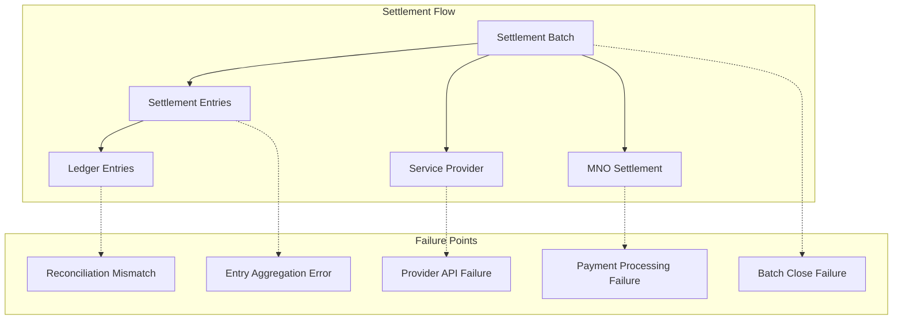

# Settlement Failure Incident Response Runbook

## Overview

This runbook provides procedures for responding to settlement batch failures between the USSD Immutable Ledger and service providers/MNOs.

## Settlement Architecture



## Failure Type Classification

| Code | Type | Description | Severity |
|------|------|-------------|----------|
| SET-001 | Batch Close | Unable to close settlement batch | P2-High |
| SET-002 | Aggregation | Sum discrepancies in batch totals | P1-Critical |
| SET-003 | Provider API | Service provider API unavailable | P2-High |
| SET-004 | Reconciliation | Ledger vs batch mismatch | P1-Critical |
| SET-005 | Payment | Fund transfer failure | P1-Critical |
| SET-006 | Notification | Settlement notification failed | P3-Medium |

---

## Compliance

### ISO Standards Mapping

| ISO Standard | Requirement | Implementation |
|--------------|-------------|----------------|
| **ISO 27001:2022** | A.5.24 - Information security incident management | Structured incident response for settlement failures |
| **ISO 27001:2022** | A.8.1 - User endpoint devices | Secure API endpoints for provider communication |
| **ISO 20022** | Financial transaction standards | Settlement batch format compliance |
| **ISO 8583** | Card transaction messaging | Reconciliation message formats |
| **ISO 22301** | Business continuity | Settlement failure recovery procedures |
| **ISO 27031** | ICT readiness for business continuity | Settlement system resilience |

### Regulatory Compliance

| Regulation | Compliance Requirement |
|------------|------------------------|
| **PSD2** | Settlement finality and fund availability |
| **SOX Section 404** | Financial controls for settlement processing |
| **Basel III** | Operational risk for payment systems |
| **GDPR Article 33** | Breach notification if settlement data exposed |
| **PCI DSS 4.0** | Secure transmission of settlement data |
| **AML/CFT** | Suspicious settlement pattern detection |

---

## Security Considerations

### Settlement Security Model

```
┌─────────────────────────────────────────────────────────────────┐
│                    SETTLEMENT SECURITY CONTROLS                  │
├─────────────────────────────────────────────────────────────────┤
│ 1. Authorization Controls                                        │
│    - Batch close: SETTLEMENT_OPERATOR role                       │
│    - Payment initiation: SETTLEMENT_ADMIN role                   │
│    - Batch reopen: Emergency dual-control                        │
│    - Correction entries: CFO approval required                   │
├─────────────────────────────────────────────────────────────────┤
│ 2. API Security                                                  │
│    - MTLS for all provider connections                           │
│    - Request signing for settlement notifications                │
│    - API rate limiting per provider                              │
│    - IP whitelisting for provider endpoints                      │
├─────────────────────────────────────────────────────────────────┤
│ 3. Data Protection                                               │
│    - Settlement amounts encrypted in transit (TLS 1.3)           │
│    - Account numbers tokenized                                   │
│    - Settlement reports encrypted at rest                        │
│    - PII masked in settlement logs                               │
├─────────────────────────────────────────────────────────────────┤
│ 4. Financial Controls                                            │
│    - Dual-control for large settlements (>$100K)                 │
│    - Automated reconciliation before payment                     │
│    - Settlement limits per provider                              │
│    - Exception reporting for unusual patterns                    │
└─────────────────────────────────────────────────────────────────┘
```

### Security Checklist

| Phase | Check | Verification |
|-------|-------|--------------|
| Detection | Settlement failure alert received | PagerDuty notification |
| Assessment | Financial impact calculated | Exposure query executed |
| Containment | Further payments suspended | Payment gateway status verified |
| Recovery | Reconciliation passed | Ledger vs batch match confirmed |
| Closure | All parties notified | Provider confirmation received |

### Fraud Prevention

| Risk | Mitigation |
|------|------------|
| Duplicate settlements | Idempotency keys on all payments |
| Unauthorized settlement changes | Immutable batch after close |
| Provider impersonation | Certificate pinning + request signing |
| Settlement amount manipulation | Dual-control for corrections |

---

## Audit Requirements

### Required Audit Records

| Record Type | Location | Retention | Standard |
|-------------|----------|-----------|----------|
| Settlement batch lifecycle | settlement_batch_history | 7 years | SOX, Basel |
| Payment transactions | settlement_payments | 7 years | Financial audit |
| Reconciliation results | settlement_reconciliation | 7 years | SOX |
| Correction entries | settlement_corrections | 7 years | Financial audit |
| Provider communications | settlement_communications | 3 years | Contract compliance |

### Audit Log Schema

```sql
CREATE TABLE settlement_incident_log (
    incident_id UUID PRIMARY KEY DEFAULT gen_random_uuid(),
    batch_id VARCHAR(100) NOT NULL,
    provider_id VARCHAR(100) NOT NULL,
    failure_type VARCHAR(50) NOT NULL,  -- SET-001 through SET-006
    severity VARCHAR(10) NOT NULL,  -- P1, P2, P3
    detected_at TIMESTAMP NOT NULL,
    detected_by VARCHAR(100),
    financial_exposure DECIMAL(19,4),
    affected_entries INTEGER,
    root_cause TEXT,
    resolution_action TEXT,
    resolved_at TIMESTAMP,
    time_to_resolve_minutes INTEGER,
    status VARCHAR(20) NOT NULL
);
```

### Audit Query Examples

```sql
-- Settlement failure trends
SELECT 
    failure_type,
    COUNT(*) as incident_count,
    AVG(time_to_resolve_minutes) as avg_resolution_time,
    SUM(financial_exposure) as total_exposure
FROM settlement_incident_log
WHERE detected_at > NOW() - INTERVAL '12 months'
GROUP BY failure_type
ORDER BY incident_count DESC;

-- Provider reliability metrics
SELECT 
    provider_id,
    COUNT(*) FILTER (WHERE status = 'RESOLVED') as resolved_count,
    COUNT(*) FILTER (WHERE status = 'ESCALATED') as escalated_count,
    AVG(time_to_resolve_minutes) as avg_resolution_time
FROM settlement_incident_log
WHERE detected_at > NOW() - INTERVAL '6 months'
GROUP BY provider_id;
```

---

## Data Protection Notes

### PII in Settlement Data

| Data Element | Classification | Handling |
|--------------|---------------|----------|
| Provider ID | Internal | Standard access controls |
| Settlement amounts | Financial | Audit logging required |
| Account numbers | Sensitive | Tokenized in storage |
| Bank routing info | Critical | Encrypted + HSM protected |
| Provider contact info | Internal | Contact database only |

### Retention Policy

| Data Type | Retention | Justification |
|-----------|-----------|---------------|
| Settlement batches | 7 years | Financial audit requirements |
| Payment confirmations | 7 years | Proof of settlement |
| Failed settlement attempts | 3 years | Fraud investigation |
| Provider API logs | 90 days | Troubleshooting only |
| Reconciliation reports | 7 years | Regulatory compliance |

### Cross-Border Settlements

- **Currency conversion**: Rates logged with audit trail
- **Data residency**: Settlement data stored per jurisdiction requirements
- **Sanctions screening**: Automated screening before settlement

---

## Immediate Response (First 10 Minutes)

### Step 1: Identify Failure Type

```sql
-- Settlement failure diagnostic query
WITH failed_batches AS (
    SELECT 
        batch_id,
        service_provider_id,
        status,
        batch_type,
        opened_at,
        closed_at,
        total_amount,
        entry_count,
        error_code,
        error_message
    FROM settlement_batches
    WHERE status IN ('ERROR', 'CLOSE_FAILED', 'PAYMENT_FAILED')
      AND opened_at > NOW() - INTERVAL '24 hours'
),
batch_details AS (
    SELECT 
        fb.*,
        sp.provider_name,
        sp.settlement_schedule,
        (SELECT COUNT(*) FROM settlement_entries 
         WHERE batch_id = fb.batch_id) as actual_entry_count,
        (SELECT SUM(amount) FROM settlement_entries 
         WHERE batch_id = fb.batch_id) as calculated_total
    FROM failed_batches fb
    JOIN service_providers sp ON fb.service_provider_id = sp.provider_id
)
SELECT 
    batch_id,
    provider_name,
    status,
    batch_type,
    total_amount,
    calculated_total,
    total_amount - calculated_total as discrepancy,
    entry_count,
    actual_entry_count,
    error_code,
    error_message
FROM batch_details
ORDER BY opened_at DESC;
```

### Step 2: Assess Financial Impact

```sql
-- Calculate financial exposure
WITH exposure AS (
    SELECT 
        sb.batch_id,
        sb.service_provider_id,
        sp.provider_name,
        sb.total_amount,
        sb.currency_code,
        sb.status,
        CASE 
            WHEN sb.status = 'PAYMENT_FAILED' THEN 'FUNDS_AT_RISK'
            WHEN sb.status = 'CLOSE_FAILED' THEN 'DELAYED_SETTLEMENT'
            WHEN sb.status = 'ERROR' THEN 'REQUIRES_INVESTIGATION'
        END as risk_type,
        DATE_PART('hour', NOW() - sb.opened_at) as hours_delayed
    FROM settlement_batches sb
    JOIN service_providers sp ON sb.service_provider_id = sp.provider_id
    WHERE sb.status NOT IN ('SETTLED', 'CLOSED')
)
SELECT 
    risk_type,
    COUNT(*) as batch_count,
    SUM(total_amount) as total_exposure,
    currency_code,
    AVG(hours_delayed)::int as avg_delay_hours
FROM exposure
GROUP BY risk_type, currency_code
ORDER BY total_exposure DESC;
```

### Step 3: Immediate Containment

```sql
-- Prevent further batch operations if systemic issue
-- Create incident flag
INSERT INTO settlement_incident_flags (
    incident_type,
    severity,
    description,
    affected_providers,
    financial_exposure,
    created_at
) 
SELECT 
    'SETTLEMENT_FAILURE',
    CASE 
        WHEN COUNT(*) > 5 THEN 'CRITICAL'
        WHEN COUNT(*) > 1 THEN 'HIGH'
        ELSE 'MEDIUM'
    END,
    'Multiple settlement batches in failed state',
    ARRAY_AGG(DISTINCT service_provider_id),
    SUM(total_amount),
    NOW()
FROM settlement_batches
WHERE status IN ('ERROR', 'CLOSE_FAILED', 'PAYMENT_FAILED')
  AND opened_at > NOW() - INTERVAL '24 hours';

-- Log incident
INSERT INTO settlement_incident_log (
    batch_id, provider_id, failure_type, severity,
    detected_at, detected_by, financial_exposure, status
)
SELECT 
    batch_id,
    service_provider_id,
    COALESCE(error_code, 'SET-001'),
    CASE 
        WHEN total_amount > 100000 THEN 'P1'
        WHEN total_amount > 10000 THEN 'P2'
        ELSE 'P3'
    END,
    NOW(),
    current_user,
    total_amount,
    'OPEN'
FROM settlement_batches
WHERE status IN ('ERROR', 'CLOSE_FAILED', 'PAYMENT_FAILED')
  AND opened_at > NOW() - INTERVAL '1 hour';

-- Notify on-call
NOTIFY settlement_alert, '{
    "type": "settlement_failure", 
    "severity": "high",
    "action_required": "immediate"
}';
```

---

## Investigation Procedures

### Investigation A: Batch Aggregation Error (SET-002)

```sql
-- Verify batch totals match constituent entries
WITH batch_validation AS (
    SELECT 
        sb.batch_id,
        sb.total_amount as stated_total,
        sb.entry_count as stated_count,
        COALESCE(SUM(se.amount), 0) as calculated_total,
        COUNT(se.settlement_entry_id) as calculated_count,
        STRING_AGG(DISTINCT se.entry_type, ', ') as entry_types
    FROM settlement_batches sb
    LEFT JOIN settlement_entries se ON sb.batch_id = se.batch_id
    WHERE sb.batch_id = 'TARGET_BATCH_ID'
    GROUP BY sb.batch_id, sb.total_amount, sb.entry_count
)
SELECT 
    batch_id,
    stated_total,
    calculated_total,
    stated_total - calculated_total as total_discrepancy,
    stated_count,
    calculated_count,
    stated_count - calculated_count as count_discrepancy,
    entry_types,
    CASE 
        WHEN stated_total = calculated_total AND stated_count = calculated_count 
        THEN 'VALID'
        ELSE 'MISMATCH'
    END as validation_result
FROM batch_validation;

-- Identify missing or extra entries
SELECT 
    le.transaction_ref,
    le.entry_type,
    le.amount,
    le.created_at,
    CASE 
        WHEN se.settlement_entry_id IS NULL THEN 'MISSING_FROM_BATCH'
        ELSE 'IN_BATCH'
    END as batch_status
FROM ledger_entries le
LEFT JOIN settlement_entries se ON le.entry_uuid = se.ledger_entry_uuid
WHERE le.created_at >= 'BATCH_START_DATE'
  AND le.created_at < 'BATCH_END_DATE'
  AND le.account_id IN (SELECT account_id FROM service_provider_accounts 
                        WHERE provider_id = 'TARGET_PROVIDER')
  AND (se.batch_id = 'TARGET_BATCH_ID' OR se.batch_id IS NULL)
ORDER BY le.created_at;
```

### Investigation B: Provider API Failure (SET-003)

```bash
#!/bin/bash
# provider_api_diagnostic.sh

PROVIDER_ID=$1
INCIDENT_ID=$2
PROVIDER_CONFIG=$(psql -t -c "SELECT api_endpoint, auth_type FROM service_providers WHERE provider_id = '$PROVIDER_ID';")

echo "Incident: $INCIDENT_ID"
echo "Provider: $PROVIDER_ID"
echo "=== Testing Provider API Connectivity ==="

# Test connectivity
curl -w "\nHTTP Code: %{http_code}\nTime: %{time_total}s\n" \
     -o /dev/null \
     -s \
     --connect-timeout 10 \
     $PROVIDER_CONFIG/api/health

# Check authentication
echo "=== Testing Authentication ==="
API_KEY=$(psql -t -c "SELECT auth_config->>'api_key' FROM service_providers WHERE provider_id = '$PROVIDER_ID';")
curl -H "Authorization: Bearer $API_KEY" \
     -w "\nAuth Test HTTP: %{http_code}\n" \
     -o /dev/null \
     -s \
     $PROVIDER_CONFIG/api/auth/test

# Check settlement endpoint
echo "=== Testing Settlement Endpoint ==="
curl -X POST \
     -H "Content-Type: application/json" \
     -H "Authorization: Bearer $API_KEY" \
     -d '{"test": true}' \
     -w "\nSettlement Endpoint HTTP: %{http_code}\n" \
     -o /dev/null \
     -s \
     $PROVIDER_CONFIG/api/settlements/notify
```

### Investigation C: Reconciliation Mismatch (SET-004)

```sql
-- Full reconciliation between ledger and settlement
WITH ledger_summary AS (
    SELECT 
        DATE_TRUNC('day', le.created_at) as settlement_day,
        sp.provider_id,
        COUNT(*) as ledger_entry_count,
        SUM(CASE WHEN le.entry_type = 'CREDIT' THEN le.amount ELSE 0 END) as total_credits,
        SUM(CASE WHEN le.entry_type = 'DEBIT' THEN le.amount ELSE 0 END) as total_debits,
        SUM(CASE WHEN le.entry_type = 'CREDIT' THEN le.amount ELSE -le.amount END) as net_amount
    FROM ledger_entries le
    JOIN accounts a ON le.account_id = a.account_id
    JOIN service_providers sp ON a.service_provider_id = sp.provider_id
    WHERE le.created_at >= 'INVESTIGATION_START_DATE'
      AND le.created_at < 'INVESTIGATION_END_DATE'
    GROUP BY 1, 2
),
settlement_summary AS (
    SELECT 
        DATE_TRUNC('day', sb.batch_date) as settlement_day,
        sb.service_provider_id as provider_id,
        COUNT(*) as batch_count,
        SUM(sb.total_amount) as batched_amount,
        SUM(sb.entry_count) as batched_entry_count
    FROM settlement_batches sb
    WHERE sb.batch_date >= 'INVESTIGATION_START_DATE'
      AND sb.batch_date < 'INVESTIGATION_END_DATE'
    GROUP BY 1, 2
)
SELECT 
    COALESCE(ls.settlement_day, ss.settlement_day) as settlement_date,
    COALESCE(ls.provider_id, ss.provider_id) as provider_id,
    ls.ledger_entry_count,
    ss.batched_entry_count,
    ls.ledger_entry_count - ss.batched_entry_count as entry_discrepancy,
    ls.net_amount as ledger_net,
    ss.batched_amount as settlement_total,
    ls.net_amount - ss.batched_amount as amount_discrepancy,
    CASE 
        WHEN ls.net_amount = ss.batched_amount THEN 'RECONCILED'
        WHEN ss.batched_amount IS NULL THEN 'MISSING_BATCH'
        WHEN ls.net_amount IS NULL THEN 'EXTRA_BATCH'
        ELSE 'MISMATCH'
    END as reconciliation_status
FROM ledger_summary ls
FULL OUTER JOIN settlement_summary ss 
    ON ls.settlement_day = ss.settlement_day 
    AND ls.provider_id = ss.provider_id
ORDER BY settlement_date DESC, ABS(COALESCE(ls.net_amount, 0) - COALESCE(ss.batched_amount, 0)) DESC;
```

---

## Remediation Procedures

### Remediation A: Correct Batch Aggregation

```sql
-- Recalculate and update batch totals
BEGIN;

-- Step 1: Lock batch for update
SELECT * FROM settlement_batches 
WHERE batch_id = 'TARGET_BATCH_ID' 
FOR UPDATE;

-- Step 2: Recalculate totals
WITH correct_totals AS (
    SELECT 
        COUNT(*) as correct_count,
        SUM(amount) as correct_total
    FROM settlement_entries
    WHERE batch_id = 'TARGET_BATCH_ID'
)
-- Step 3: Update batch with correct totals
UPDATE settlement_batches
SET 
    total_amount = (SELECT correct_total FROM correct_totals),
    entry_count = (SELECT correct_count FROM correct_totals),
    status = 'CLOSED',
    closed_at = NOW(),
    recalculated = true,
    recalculation_reason = 'Corrected aggregation error - SET-002'
WHERE batch_id = 'TARGET_BATCH_ID';

-- Step 4: Log correction
INSERT INTO settlement_corrections (
    batch_id,
    correction_type,
    original_amount,
    corrected_amount,
    original_count,
    corrected_count,
    corrected_by,
    corrected_at
)
SELECT 
    'TARGET_BATCH_ID',
    'AGGREGATION_FIX',
    OLD.total_amount,
    NEW.total_amount,
    OLD.entry_count,
    NEW.entry_count,
    current_user,
    NOW()
FROM settlement_batches
WHERE batch_id = 'TARGET_BATCH_ID';

-- Step 5: Log incident resolution
UPDATE settlement_incident_log
SET 
    status = 'RESOLVED',
    resolved_at = NOW(),
    resolution_action = 'Batch aggregation corrected',
    time_to_resolve_minutes = EXTRACT(EPOCH FROM (NOW() - detected_at))/60
WHERE batch_id = 'TARGET_BATCH_ID';

COMMIT;
```

### Remediation B: Retry Provider API Call

```sql
-- Create retry queue entry
INSERT INTO settlement_retry_queue (
    batch_id,
    provider_id,
    failure_reason,
    retry_count,
    next_retry_at,
    max_retries
)
VALUES (
    'TARGET_BATCH_ID',
    'PROVIDER_ID',
    'API_TIMEOUT',
    0,
    NOW() + INTERVAL '5 minutes',
    5
);

-- Implement exponential backoff retry (run via cron/job scheduler)
CREATE OR REPLACE FUNCTION process_settlement_retries()
RETURNS void AS $$
DECLARE
    v_retry RECORD;
    v_result BOOLEAN;
BEGIN
    FOR v_retry IN 
        SELECT * FROM settlement_retry_queue
        WHERE next_retry_at <= NOW()
          AND retry_count < max_retries
          AND status = 'PENDING'
        FOR UPDATE SKIP LOCKED
    LOOP
        BEGIN
            -- Attempt provider notification
            v_result := notify_provider_settlement(v_retry.batch_id, v_retry.provider_id);
            
            IF v_result THEN
                -- Success - remove from queue
                UPDATE settlement_retry_queue
                SET status = 'SUCCESS', completed_at = NOW()
                WHERE id = v_retry.id;
                
                UPDATE settlement_batches
                SET status = 'NOTIFIED', notified_at = NOW()
                WHERE batch_id = v_retry.batch_id;
                
                -- Log resolution
                UPDATE settlement_incident_log
                SET status = 'RESOLVED', resolved_at = NOW()
                WHERE batch_id = v_retry.batch_id;
            ELSE
                -- Failed - schedule next retry
                UPDATE settlement_retry_queue
                SET 
                    retry_count = retry_count + 1,
                    next_retry_at = NOW() + (INTERVAL '5 minutes' * POWER(2, retry_count)),
                    last_error = 'Provider notification failed'
                WHERE id = v_retry.id;
            END IF;
            
        EXCEPTION WHEN OTHERS THEN
            UPDATE settlement_retry_queue
            SET 
                retry_count = retry_count + 1,
                next_retry_at = NOW() + INTERVAL '15 minutes',
                last_error = SQLERRM
            WHERE id = v_retry.id;
        END;
    END LOOP;
END;
$$ LANGUAGE plpgsql;
```

### Remediation C: Handle Payment Failure

```sql
-- Payment failure recovery procedure
CREATE OR REPLACE PROCEDURE recover_payment_failure(
    p_batch_id VARCHAR,
    p_action VARCHAR,  -- 'RETRY', 'MANUAL', 'ESCALATE'
    p_incident_id UUID
)
LANGUAGE plpgsql
AS $$
DECLARE
    v_batch RECORD;
    v_payment_provider RECORD;
BEGIN
    SELECT * INTO v_batch 
    FROM settlement_batches 
    WHERE batch_id = p_batch_id;
    
    CASE p_action
        WHEN 'RETRY' THEN
            -- Re-initiate payment
            UPDATE settlement_batches
            SET 
                status = 'PAYMENT_RETRYING',
                payment_attempts = COALESCE(payment_attempts, 0) + 1,
                last_payment_attempt = NOW()
            WHERE batch_id = p_batch_id;
            
            -- Trigger payment processor retry
            PERFORM pg_notify('payment_retry', json_build_object(
                'batch_id', p_batch_id,
                'amount', v_batch.total_amount,
                'provider', v_batch.service_provider_id
            )::text);
            
        WHEN 'MANUAL' THEN
            -- Flag for manual intervention
            UPDATE settlement_batches
            SET 
                status = 'PAYMENT_MANUAL_REVIEW',
                manual_review_flag = true,
                flagged_at = NOW(),
                flagged_by = current_user
            WHERE batch_id = p_batch_id;
            
            -- Create ticket in ticketing system
            INSERT INTO support_tickets (
                ticket_type,
                priority,
                description,
                reference_id,
                reference_type
            ) VALUES (
                'PAYMENT_FAILURE',
                'HIGH',
                format('Manual payment required for batch %s, amount %s', 
                       p_batch_id, v_batch.total_amount),
                p_batch_id,
                'SETTLEMENT_BATCH'
            );
            
        WHEN 'ESCALATE' THEN
            -- Escalate to finance team
            UPDATE settlement_batches
            SET 
                status = 'PAYMENT_ESCALATED',
                escalation_time = NOW()
            WHERE batch_id = p_batch_id;
            
            -- Send escalation notification
            PERFORM pg_notify('finance_escalation', json_build_object(
                'batch_id', p_batch_id,
                'amount', v_batch.total_amount,
                'provider_id', v_batch.service_provider_id,
                'escalation_reason', 'Multiple payment failures',
                'incident_id', p_incident_id
            )::text);
    END CASE;
END;
$$;
```

---

## Rollback Procedures

### Rollback A: Reopen Closed Batch

```sql
-- Emergency batch reopen (requires admin privilege)
BEGIN;

-- Step 1: Verify batch can be reopened
SELECT status, closed_at, payment_initiated
FROM settlement_batches
WHERE batch_id = 'TARGET_BATCH_ID';

-- Only proceed if payment not yet initiated
-- Step 2: Reopen batch
UPDATE settlement_batches
SET 
    status = 'REOPENED',
    closed_at = NULL,
    reopened_at = NOW(),
    reopened_by = current_user,
    reopen_reason = 'Settlement failure - requires correction'
WHERE batch_id = 'TARGET_BATCH_ID'
  AND payment_initiated = false;

-- Step 3: Log reopening
INSERT INTO settlement_batch_history (
    batch_id,
    action,
    performed_by,
    performed_at,
    previous_status,
    new_status
) VALUES (
    'TARGET_BATCH_ID',
    'REOPEN',
    current_user,
    NOW(),
    'CLOSED',
    'REOPENED'
);

COMMIT;
```

### Rollback B: Reverse Erroneous Settlement

```sql
-- Create reversal entry for incorrect settlement
BEGIN;

-- Step 1: Create reversal batch
INSERT INTO settlement_batches (
    batch_id,
    service_provider_id,
    batch_type,
    status,
    batch_date,
    total_amount,
    entry_count,
    reversal_of_batch_id,
    notes
)
SELECT 
    'REV-' || batch_id,
    service_provider_id,
    'REVERSAL',
    'PENDING',
    CURRENT_DATE,
    -total_amount,  -- Negative amount
    entry_count,
    batch_id,
    'Reversal of erroneous settlement'
FROM settlement_batches
WHERE batch_id = 'ERRONEOUS_BATCH_ID';

-- Step 2: Create reversal entries
INSERT INTO settlement_entries (
    batch_id,
    ledger_entry_uuid,
    amount,
    entry_type,
    reversal_of_entry_id
)
SELECT 
    'REV-' || se.batch_id,
    se.ledger_entry_uuid,
    -se.amount,
    'REVERSAL',
    se.settlement_entry_id
FROM settlement_entries se
WHERE se.batch_id = 'ERRONEOUS_BATCH_ID';

-- Step 3: Mark original as reversed
UPDATE settlement_batches
SET 
    status = 'REVERSED',
    reversed_at = NOW(),
    reversal_batch_id = 'REV-' || batch_id
WHERE batch_id = 'ERRONEOUS_BATCH_ID';

COMMIT;
```

---

## Communication Templates

### Provider Notification

```
Subject: [URGENT] Settlement Delay Notice - Batch {{BATCH_ID}}

Dear {{PROVIDER_NAME}} Finance Team,

We are writing to inform you of a delay in settlement batch {{BATCH_ID}} 
scheduled for {{SCHEDULED_DATE}}.

Details:
- Batch ID: {{BATCH_ID}}
- Settlement Amount: {{AMOUNT}} {{CURRENCY}}
- Original Settlement Date: {{SCHEDULED_DATE}}
- New Expected Date: {{NEW_DATE}}
- Reason: {{FAILURE_REASON}}

We are actively working to resolve this issue and will provide updates 
every 2 hours until resolved.

For urgent inquiries, please contact:
- Email: settlements@company.com
- Phone: +1-xxx-xxx-xxxx (24/7 hotline)

Reference: {{INCIDENT_ID}}

Confidential - Internal Use Only
```

### Internal Escalation

```
🚨 SETTLEMENT FAILURE - ESCALATION 🚨

Incident ID: {{INCIDENT_ID}}
Severity: {{SEVERITY}}
Time Open: {{DURATION}}

Financial Impact:
- Affected Providers: {{PROVIDER_COUNT}}
- Total Amount at Risk: {{TOTAL_EXPOSURE}}
- Largest Single Batch: {{MAX_BATCH_AMOUNT}}

Root Cause: {{ROOT_CAUSE}}

Actions Taken:
{{ACTIONS_LIST}}

Next Steps:
{{NEXT_STEPS}}

Decision Required: {{DECISION_NEEDED}}

Classification: INTERNAL USE ONLY
```

---

## TODOs

- [ ] Automate settlement batch pre-validation
- [ ] Implement provider API circuit breaker
- [ ] Create real-time settlement dashboard
- [ ] Add settlement forecasting and alerting
- [ ] Design multi-provider settlement orchestration
- [ ] Implement settlement blockchain anchoring
- [ ] Create settlement dispute management workflow
- [ ] Add settlement regulatory reporting automation
- [ ] Design settlement netting/clearing optimization
- [ ] Implement settlement insurance/bonding tracking
