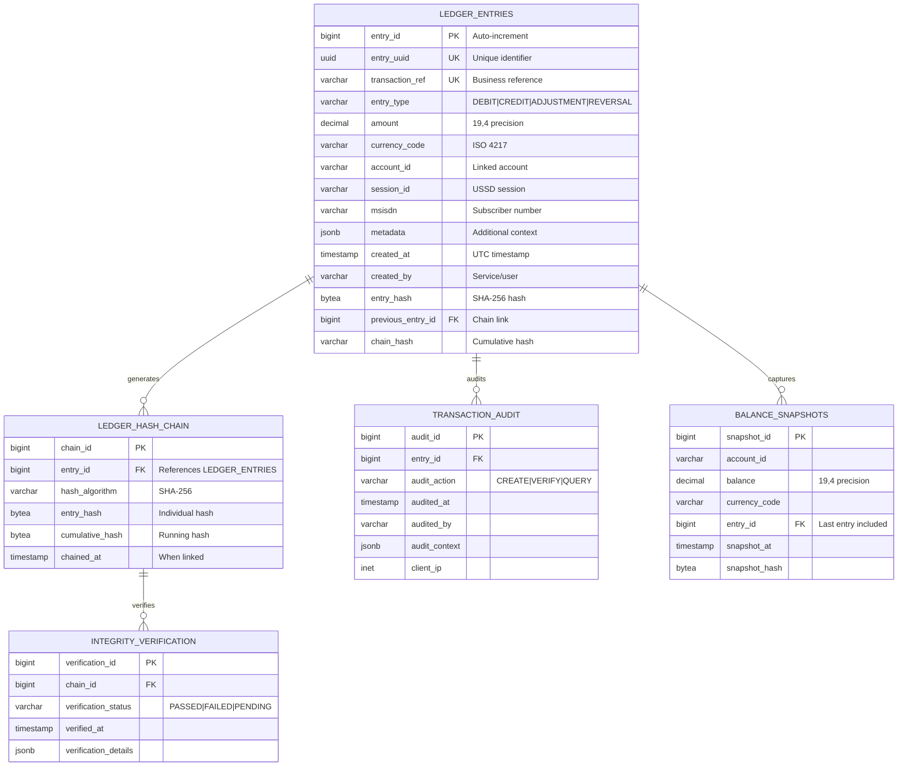

# Core Schema ERD Documentation

## Overview

The Core Schema defines the immutable ledger foundation for the USSD transaction processing system. All tables implement immutable design patterns with append-only semantics.

## Entity Relationship Diagram



## Table Descriptions

### LEDGER_ENTRIES

The primary immutable transaction log. Every financial transaction creates exactly one entry.

**Key Constraints:**
- `entry_uuid` - UUID v4 for global uniqueness
- `transaction_ref` - Business-provided reference (max 64 chars)
- `entry_type` - ENUM: DEBIT, CREDIT, ADJUSTMENT, REVERSAL
- Composite unique: `(transaction_ref, entry_type)` for idempotency

**Immutable Guarantees:**
- No UPDATE operations allowed (row-level security)
- No DELETE operations allowed
- `created_at` defaults to `CURRENT_TIMESTAMP`

### LEDGER_HASH_CHAIN

Cryptographic chain linking all entries. Ensures tamper-evident audit trail.

**Chain Algorithm:**
```
cumulative_hash[n] = SHA256(
    entry_hash[n] || 
    cumulative_hash[n-1] || 
    CAST(created_at AS BYTEA)
)
```

**Genesis Entry:**
- First entry uses `0x00...00` (32 bytes) as previous hash

### TRANSACTION_AUDIT

Non-repudiation audit trail for all access patterns.

**Tracked Operations:**
- Entry creation
- Balance queries
- Hash verification
- Administrative actions

### BALANCE_SNAPSHOTS

Point-in-time balance calculations for performance optimization.

**Snapshot Strategy:**
- Hourly snapshots for active accounts
- On-demand snapshots for reconciliation
- Prunable after archival (per retention policy)

### INTEGRITY_VERIFICATION

Scheduled and on-demand hash verification results.

**Verification Types:**
- `FULL` - Complete chain traversal
- `INCREMENTAL` - Since last verified point
- `SPOT` - Random sampling

## Indexes

```sql
-- Performance indexes
CREATE INDEX idx_ledger_entries_account ON LEDGER_ENTRIES(account_id, created_at DESC);
CREATE INDEX idx_ledger_entries_session ON LEDGER_ENTRIES(session_id);
CREATE INDEX idx_ledger_entries_msisdn ON LEDGER_ENTRIES(msisdn, created_at DESC);
CREATE INDEX idx_ledger_entries_created ON LEDGER_ENTRIES(created_at);

-- Hash chain index
CREATE INDEX idx_hash_chain_entry ON LEDGER_HASH_CHAIN(entry_id);

-- Audit indexes
CREATE INDEX idx_audit_entry ON TRANSACTION_AUDIT(entry_id);
CREATE INDEX idx_audit_time ON TRANSACTION_AUDIT(audited_at);

-- Balance index
CREATE INDEX idx_balance_account ON BALANCE_SNAPSHOTS(account_id, snapshot_at DESC);
```

## Partitioning Strategy

**LEDGER_ENTRIES** is range-partitioned by `created_at`:
- Monthly partitions: `ledger_entries_YYYY_MM`
- Default partition: `ledger_entries_default`
- Archive partitions after 90 days (read-only)

---

## Compliance

### ISO Standards Mapping

| ISO Standard | Requirement | Implementation |
|--------------|-------------|----------------|
| **ISO 27001:2022** | A.5.33 - Protection of records | Immutable append-only ledger with cryptographic hash chain ensures records cannot be tampered with or deleted |
| **ISO 27001:2022** | A.5.34 - Privacy and protection of PIIs | MSISDN and account data segregated; PII access logged in TRANSACTION_AUDIT |
| **ISO 27001:2022** | A.8.11 - Data masking | Sensitive fields masked in non-production environments via view layer |
| **ISO 20022** | Financial transaction messaging | Transaction_ref and entry_type align with ISO 20022 payment message standards |
| **ISO 8583** | Card transaction messaging | Entry structure compatible with ISO 8583 message field mappings |
| **ISO 19086** | Cloud service level agreements | Ledger availability SLA tracked via BALANCE_SNAPSHOTS for reconciliation windows |

### Regulatory Compliance

| Regulation | Schema Compliance |
|------------|-------------------|
| **PCI DSS 4.0** | PAN data NOT stored in core ledger; tokenized references only |
| **GDPR Article 17** | Right to erasure implemented via "anonymization entries" rather than deletion |
| **SOX Section 302** | Immutable ledger provides CFO attestation support for financial controls |
| **Basel III** | Transaction traceability supports liquidity ratio calculations |

---

## Security Considerations

### Access Control Model

```
┌─────────────────────────────────────────────────────────────┐
│                    ACCESS CONTROL LAYERS                     │
├─────────────────────────────────────────────────────────────┤
│ 1. Database Role Separation                                  │
│    - ledger_reader: SELECT only on LEDGER_ENTRIES            │
│    - ledger_writer: INSERT only on LEDGER_ENTRIES            │
│    - ledger_admin: Full access to INTEGRITY_VERIFICATION     │
├─────────────────────────────────────────────────────────────┤
│ 2. Row-Level Security (RLS)                                  │
│    - Entries filtered by service_provider_id                 │
│    - Multi-tenant data isolation                             │
├─────────────────────────────────────────────────────────────┤
│ 3. Column-Level Encryption                                   │
│    - metadata field: Application-level AES-256 encryption    │
│    - msisdn: Tokenized before storage                        │
├─────────────────────────────────────────────────────────────┤
│ 4. Audit Logging                                             │
│    - All SELECT queries logged to TRANSACTION_AUDIT          │
│    - Hash verification attempts logged with IP tracking      │
└─────────────────────────────────────────────────────────────┘
```

### Cryptographic Controls

| Control | Implementation | Strength |
|---------|---------------|----------|
| Entry Hash | SHA-256 | 256-bit collision resistance |
| Chain Hash | SHA-256 with cumulative chaining | Tamper-evident chain |
| Data at Rest | AES-256-GCM | Industry standard |
| Data in Transit | TLS 1.3 | Forward secrecy |

### Threat Mitigation

| Threat | Mitigation Strategy |
|--------|---------------------|
| Insider tampering | Immutable append-only design prevents UPDATE/DELETE |
| Chain manipulation | Cryptographic hash chain makes tampering computationally infeasible |
| Replay attacks | UUID v4 entry_uuid ensures global uniqueness |
| Audit log tampering | TRANSACTION_AUDIT writes to separate physical storage |

---

## Audit Requirements

### Required Audit Events

| Event Type | Table | Retention | Storage |
|------------|-------|-----------|---------|
| Entry creation | TRANSACTION_AUDIT | 7 years | Write-once storage |
| Balance query | TRANSACTION_AUDIT | 3 years | Standard storage |
| Hash verification | INTEGRITY_VERIFICATION | 7 years | Write-once storage |
| Schema changes | DDL audit log | 10 years | External SIEM |

### Audit Query Examples

```sql
-- Audit trail for specific transaction
SELECT 
    le.entry_id,
    le.transaction_ref,
    le.created_at,
    ta.audit_action,
    ta.audited_by,
    ta.client_ip,
    iv.verification_status,
    iv.verified_at
FROM ledger_entries le
LEFT JOIN transaction_audit ta ON le.entry_id = ta.entry_id
LEFT JOIN integrity_verification iv ON le.entry_id = iv.chain_id
WHERE le.transaction_ref = 'TXN-2025-001-12345'
ORDER BY ta.audited_at;

-- Compliance report: Unverified entries
SELECT 
    COUNT(*) as unverified_count,
    MIN(le.created_at) as oldest_unverified
FROM ledger_entries le
LEFT JOIN integrity_verification iv ON le.entry_id = iv.chain_id
WHERE iv.verification_id IS NULL
  AND le.created_at < NOW() - INTERVAL '24 hours';
```

### Audit Evidence Package

For regulatory examinations, the following can be exported:
1. **Hash Chain Export** - Full ledger with chain hashes for external verification
2. **Verification Certificates** - Signed verification run results
3. **Access Log Summary** - Aggregated access patterns by role/privilege
4. **Schema Version History** - DDL change log with approvals

---

## Data Protection Notes

### Data Classification

| Field | Classification | Protection Level |
|-------|---------------|------------------|
| entry_uuid | Public | None required |
| transaction_ref | Internal | Standard access controls |
| account_id | Internal | Standard access controls |
| msisdn | Sensitive (PII) | Tokenized + encrypted |
| amount | Financial | Audit logging required |
| metadata | Variable | Application-level encryption |
| entry_hash | System | Integrity protected |

### Retention Policy

| Data Type | Hot Storage | Warm Storage | Cold Storage | Deletion |
|-----------|-------------|--------------|--------------|----------|
| Ledger entries | 90 days | 1 year | 7 years | Never (immutable) |
| Audit logs | 1 year | 2 years | 7 years | After 7 years |
| Snapshots | 30 days | 90 days | 1 year | After 1 year |
| Verification records | 1 year | 7 years | 10 years | After 10 years |

### Cross-Border Data Transfer

- **Primary Storage**: Determined by data residency requirements
- **Replication**: Hash-only replication to secondary regions (no PII)
- **Encryption**: All cross-border transfers use AES-256-GCM

### Data Subject Rights (GDPR)

| Right | Technical Implementation |
|-------|-------------------------|
| Right to Access | API endpoint exports all entries for account_id |
| Right to Rectification | Correction entries with full audit trail |
| Right to Erasure | Anonymization entry (original preserved for audit) |
| Right to Portability | ISO 20022 formatted export |

---

## TODOs

- [ ] Implement automated genesis entry creation on first startup
- [ ] Add row-level security policies for immutability enforcement
- [ ] Create trigger for automatic hash chain maintenance
- [ ] Implement partition pruning automation
- [ ] Add compression for partitions older than 1 year
- [ ] Create monitoring views for entry velocity metrics
- [ ] Design cold storage archival strategy
- [ ] Implement cross-region hash replication
