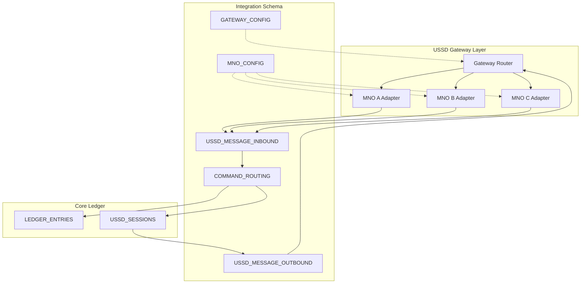
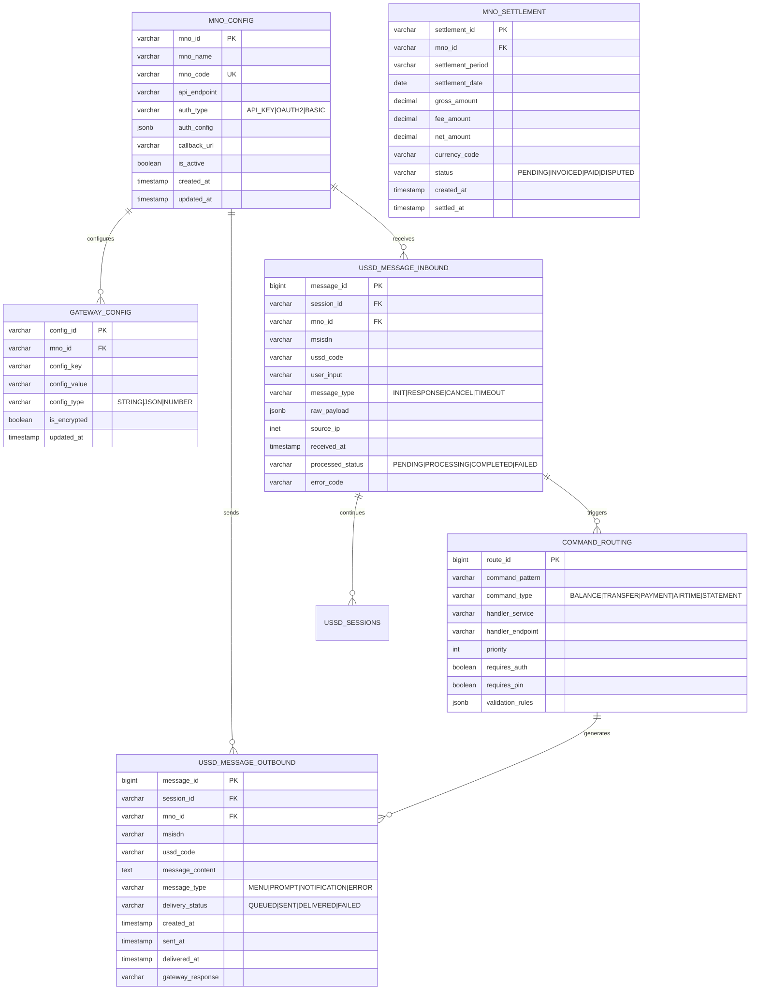
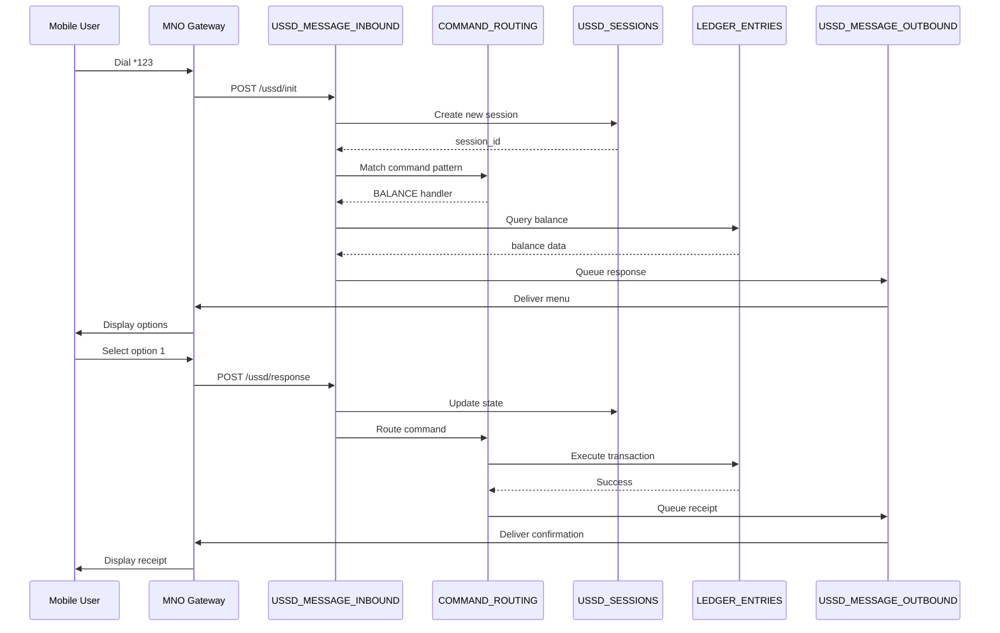

# USSD Integration Schema Documentation

## Overview

This document defines the integration layer between USSD gateways, mobile network operators (MNOs), and the immutable ledger kernel.

## Architecture Diagram



## Integration Schema ERD



## Table Descriptions

### MNO_CONFIG

Mobile Network Operator configuration registry.

**Authentication Types:**

| Type | Description | Config Fields |
|------|-------------|---------------|
| API_KEY | Static API key | `header_name`, `api_key` |
| OAUTH2 | OAuth 2.0 flow | `client_id`, `client_secret`, `token_url` |
| BASIC | HTTP Basic Auth | `username`, `password` |

**Example Configuration:**
```json
{
  "mno_id": "MNO001",
  "mno_name": "Telecom Alpha",
  "mno_code": "TA",
  "api_endpoint": "https://api.telecomalpha.com/ussd/v2",
  "auth_type": "OAUTH2",
  "auth_config": {
    "client_id": "ussd_client_001",
    "client_secret": "[ENCRYPTED]",
    "token_url": "https://auth.telecomalpha.com/oauth/token",
    "scope": "ussd:send ussd:receive"
  }
}
```

### GATEWAY_CONFIG

MNO-specific gateway parameters and routing rules.

**Common Config Keys:**
- `session_timeout_seconds` - Default: 30
- `max_message_length` - Default: 160
- `retry_attempts` - Default: 3
- `retry_delay_ms` - Default: 1000
- `encoding` - UTF-8 or GSM-7

### USSD_MESSAGE_INBOUND

Raw inbound USSD messages from MNOs.

**Message Types:**
- `INIT` - New session initiation
- `RESPONSE` - User response to prompt
- `CANCEL` - User cancelled session
- `TIMEOUT` - Session timed out at MNO

**Processing Pipeline:**
```
RECEIVED → PENDING → PROCESSING → [COMPLETED|FAILED]
```

### USSD_MESSAGE_OUTBOUND

Outbound messages sent to MNOs for delivery to users.

**Message Types:**
- `MENU` - Navigation menu with options
- `PROMPT` - Input request
- `NOTIFICATION` - One-way message
- `ERROR` - Error display

**Delivery Guarantees:**
- At-least-once delivery
- Idempotency via message_id
- Retry with exponential backoff

### COMMAND_ROUTING

USSD command routing configuration.

**Command Patterns:**
```
*123#              - Balance inquiry
*123*1#            - Transfer menu
*123*1*{amount}#   - Quick transfer
*123*2*{code}#     - Airtime purchase
```

**Validation Rules:**
```json
{
  "amount": {
    "type": "decimal",
    "min": 0.01,
    "max": 100000.00
  },
  "recipient": {
    "type": "msisdn",
    "format": "E164"
  }
}
```

### MNO_SETTLEMENT

Settlement tracking for MNO revenue share and fees.

**Settlement Formula:**
```
gross_amount = SUM(transaction_fees)
net_amount = gross_amount - mno_share
mno_share = gross_amount * revenue_share_pct
```

## Message Flow Sequence



## Indexes

```sql
-- MNO indexes
CREATE INDEX idx_mno_active ON MNO_CONFIG(mno_code) WHERE is_active = true;

-- Inbound message indexes
CREATE INDEX idx_inbound_session ON USSD_MESSAGE_INBOUND(session_id, received_at DESC);
CREATE INDEX idx_inbound_status ON USSD_MESSAGE_INBOUND(processed_status) 
    WHERE processed_status IN ('PENDING', 'PROCESSING');
CREATE INDEX idx_inbound_msisdn ON USSD_MESSAGE_INBOUND(msisdn, received_at DESC);

-- Outbound message indexes
CREATE INDEX idx_outbound_session ON USSD_MESSAGE_OUTBOUND(session_id, created_at DESC);
CREATE INDEX idx_outbound_status ON USSD_MESSAGE_OUTBOUND(delivery_status) 
    WHERE delivery_status IN ('QUEUED', 'SENT');

-- Command routing index
CREATE INDEX idx_command_pattern ON COMMAND_ROUTING(command_pattern);

-- Settlement indexes
CREATE INDEX idx_settlement_mno ON MNO_SETTLEMENT(mno_id, settlement_date);
```

## Error Codes

| Code | Description | Retry Strategy |
|------|-------------|----------------|
| `MNO_001` | MNO timeout | Retry 3x, then fail |
| `MNO_002` | Invalid MSISDN | Fail immediately |
| `MNO_003` | Session not found | Fail immediately |
| `MNO_004` | Authentication failed | Alert ops team |
| `MNO_005` | Rate limit exceeded | Backoff retry |

---

## Compliance

### ISO Standards Mapping

| ISO Standard | Requirement | Implementation |
|--------------|-------------|----------------|
| **ISO 27001:2022** | A.5.20 - Information security in project management | MNO_CONFIG change management for gateway updates |
| **ISO 27001:2022** | A.5.21 - Information security in supplier relationships | MNO authentication and SLA tracking in MNO_CONFIG |
| **ISO 27001:2022** | A.6.7 - Remote working | Source IP tracking in USSD_MESSAGE_INBOUND |
| **ISO 27001:2022** | A.8.5 - Secure authentication | Multiple auth types (API_KEY, OAUTH2, BASIC) |
| **ISO 8583** | Message format | raw_payload stores ISO 8583 compatible messages |
| **ITU-T E.164** | Phone number format | MSISDN validation enforces E.164 standard |

### Regulatory Compliance

| Regulation | Schema Compliance |
|------------|-------------------|
| **GDPR Article 32** | Security of processing - auth_config encrypted at rest |
| **PCI DSS 4.0 Req 4.2** | Strong cryptography for transmission - TLS 1.3 enforced |
| **Telecom Regulations** | MNO settlement tracking for interconnection agreements |
| **Data Residency** | MNO_CONFIG stores regional endpoints for data localization |

---

## Security Considerations

### Gateway Security Architecture

```
┌─────────────────────────────────────────────────────────────────┐
│                    GATEWAY SECURITY MODEL                        │
├─────────────────────────────────────────────────────────────────┤
│ 1. Authentication Layer                                          │
│    - API_KEY: HMAC-SHA256 signed requests                        │
│    - OAUTH2: Token-based with refresh rotation                   │
│    - BASIC: HTTPS-only, password complexity enforced             │
├─────────────────────────────────────────────────────────────────┤
│ 2. Transport Security                                            │
│    - TLS 1.3 mandatory for all MNO connections                   │
│    - Certificate pinning for known MNOs                          │
│    - MTLS (Mutual TLS) for high-security MNOs                    │
├─────────────────────────────────────────────────────────────────┤
│ 3. Message Validation                                            │
│    - Input sanitization on USSD_MESSAGE_INBOUND                  │
│    - Command pattern whitelist in COMMAND_ROUTING                │
│    - Rate limiting per MSISDN and MNO                            │
├─────────────────────────────────────────────────────────────────┤
│ 4. Credential Management                                         │
│    - auth_config encrypted with HSM-backed keys                  │
│    - Automatic credential rotation every 90 days                 │
│    - No plaintext secrets in logs or backups                     │
└─────────────────────────────────────────────────────────────────┘
```

### Credential Protection

| Credential Type | Storage | Encryption |
|-----------------|---------|------------|
| API Keys | GATEWAY_CONFIG (is_encrypted=true) | AES-256-GCM with HSM |
| OAuth2 client_secret | MNO_CONFIG auth_config | AES-256-GCM with HSM |
| Basic Auth credentials | MNO_CONFIG auth_config | AES-256-GCM with HSM |
| Webhook secrets | GATEWAY_CONFIG | AES-256-GCM with HSM |

### Threat Mitigation

| Threat | Mitigation Strategy |
|--------|---------------------|
| MNO impersonation | Strong authentication + certificate pinning |
| Message tampering | TLS 1.3 + request signing for webhooks |
| Replay attacks | Message deduplication via message_id + timestamp validation |
| DDoS attacks | Rate limiting per MNO and per MSISDN |
| Credential theft | HSM-backed encryption + regular rotation |

---

## Audit Requirements

### Required Audit Events

| Event Type | Table | Retention | Justification |
|------------|-------|-----------|---------------|
| MNO authentication failures | USSD_MESSAGE_INBOUND | 1 year | Security incident investigation |
| Message delivery failures | USSD_MESSAGE_OUTBOUND | 90 days | Service quality monitoring |
| Command routing changes | COMMAND_ROUTING (history) | 3 years | Change control compliance |
| MNO settlement calculations | MNO_SETTLEMENT | 7 years | Financial audit |
| Gateway configuration changes | GATEWAY_CONFIG (history) | 3 years | Change management |

### Audit Query Examples

```sql
-- MNO authentication failures (security monitoring)
SELECT 
    mno_id,
    DATE_TRUNC('hour', received_at) as hour,
    COUNT(*) as failure_count,
    COUNT(DISTINCT source_ip) as unique_ips
FROM ussd_message_inbound
WHERE processed_status = 'FAILED'
  AND error_code = 'MNO_004'
  AND received_at > NOW() - INTERVAL '24 hours'
GROUP BY mno_id, DATE_TRUNC('hour', received_at)
HAVING COUNT(*) > 10
ORDER BY failure_count DESC;

-- Message delivery SLA compliance
SELECT 
    mno_id,
    delivery_status,
    COUNT(*) as message_count,
    AVG(EXTRACT(EPOCH FROM (sent_at - created_at))) as avg_queue_time_seconds,
    AVG(EXTRACT(EPOCH FROM (delivered_at - sent_at))) as avg_delivery_time_seconds
FROM ussd_message_outbound
WHERE created_at > NOW() - INTERVAL '7 days'
GROUP BY mno_id, delivery_status
ORDER BY mno_id, delivery_status;

-- Command routing usage analysis
SELECT 
    command_type,
    COUNT(umi.message_id) as invocation_count,
    AVG(CASE WHEN umi.processed_status = 'COMPLETED' THEN 1 ELSE 0 END) as success_rate
FROM command_routing cr
LEFT JOIN ussd_message_inbound umi ON umi.ussd_code LIKE cr.command_pattern
WHERE umi.received_at > NOW() - INTERVAL '30 days'
GROUP BY command_type
ORDER BY invocation_count DESC;
```

### Audit Evidence Package

For compliance and security audits:
1. **MNO Access Log** - All authentication attempts by MNO
2. **Message Flow Traces** - End-to-end delivery confirmation
3. **Configuration Change History** - All MNO_CONFIG and GATEWAY_CONFIG changes
4. **Settlement Audit Trail** - Revenue share calculations and payments

---

## Data Protection Notes

### Data Classification

| Field | Classification | Protection Level |
|-------|---------------|------------------|
| mno_id | Public | None required |
| api_endpoint | Internal | Standard access controls |
| auth_config | Critical | AES-256-GCM + HSM |
| msisdn | Sensitive (PII) | Tokenized + encrypted |
| raw_payload | Internal | Purged after 30 days |
| source_ip | Internal | Used for fraud detection |
| message_content | Internal | Not stored (transient) |

### Retention Policy

| Data Type | Hot Storage | Warm Storage | Cold Storage | Deletion |
|-----------|-------------|--------------|--------------|----------|
| MNO configuration | Indefinite | - | - | Versioned history kept |
| Inbound messages | 30 days | 90 days | 1 year | After 1 year |
| Outbound messages | 30 days | 90 days | 1 year | After 1 year |
| Command routing | Indefinite | - | - | Soft delete with history |
| MNO settlements | 7 years | 10 years | Indefinite | Never |
| Gateway config | Indefinite | - | - | Versioned history kept |

### Cross-Border Considerations

- **MNO Endpoint Selection**: api_endpoint configured per region for data residency
- **Message Routing**: Messages routed to region-specific instances
- **Settlement Currency**: Currency code supports multi-currency settlements

### Data Subject Rights

| Right | Technical Implementation |
|-------|-------------------------|
| Right to Access | Export message history for MSISDN |
| Right to Erasure | Anonymize MSISDN in message logs |
| Right to Restrict Processing | Suspend MNO integration |

---

## TODOs

- [ ] Implement MNO health check monitoring
- [ ] Add message encryption at rest
- [ ] Create circuit breaker for MNO failures
- [ ] Implement USSD session state machine validation
- [ ] Add support for USSD push notifications
- [ ] Create MNO-specific message templates
- [ ] Implement real-time settlement calculation
- [ ] Design MNO fallback/routing logic
- [ ] Add USSD short code management UI
- [ ] Create MNO SLA monitoring dashboard
